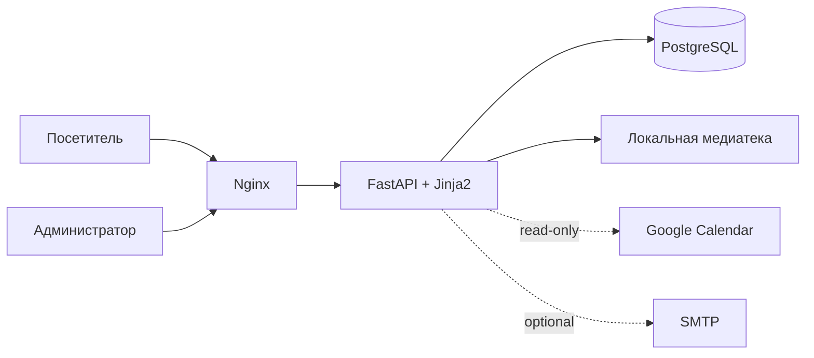

# ArtToSlipAway

Сайт-портфолио и система приёма заявок для независимого художника и тату-мастера. Проект объединяет публичный каталог работ, форму записи, календарь доступных дат, клиентский кабинет и административную панель.

Это очищенная portfolio-версия действующего проекта. В репозитории нет продакшен-паролей, ключей Google, заявок клиентов, дампов базы, загруженных пользователями файлов и приватной инфраструктуры.

## Что умеет проект

- показывает портфолио по категориям и отдельные страницы работ;
- принимает заявки с согласием на обработку персональных данных;
- отображает доступные даты по городам;
- учитывает занятость из Google Calendar в режиме read-only;
- предоставляет клиенту закрытую ссылку на материалы заявки;
- содержит CRM-функции: статусы, приоритеты, заметки и архив;
- управляет медиатекой, каруселью, объявлениями и юридическими страницами;
- собирает статистику посещений с хешированием IP-адресов;
- отправляет опциональные SMTP-уведомления о новых заявках;
- предоставляет health-check endpoints для приложения и базы.

## Стек

Python 3.12, FastAPI, PostgreSQL, psycopg2, Jinja2, JavaScript, CSS, Google Calendar API, Nginx и systemd. Для локального запуска добавлены Docker и Docker Compose.

## Архитектура



Основной модуль `app/main.py` содержит публичные страницы, заявки, каталог, календарь и административные операции. Отдельные модули отвечают за авторизацию, медиатеку, статистику, юридические документы, CRM, клиентский кабинет и системную диагностику.

## Быстрый запуск через Docker

1. Создайте локальную конфигурацию:

   ```bash
   cp .env.example .env
   ```

2. Замените демонстрационные пароли и секреты в `.env`.

3. Запустите приложение и PostgreSQL:

   ```bash
   docker compose up --build
   ```

4. Откройте [http://localhost:8000](http://localhost:8000). Административный вход расположен по адресу `/admin/login`.

Схема базы загружается из `schema.sql` при первом создании контейнера PostgreSQL. Репозиторий не содержит production-данных, поэтому каталог после запуска будет пустым.

## Запуск без Docker

Потребуются Python 3.12 и PostgreSQL 16.

```bash
python3 -m venv .venv
source .venv/bin/activate
pip install -r requirements.txt
cp .env.example .env
createdb arttoslipaway
psql arttoslipaway < schema.sql
uvicorn app.main:app --reload
```

Перед запуском укажите корректные параметры PostgreSQL и сгенерируйте независимые значения `ADMIN_SESSION_SECRET` и `STATS_IP_HASH_SECRET`.

Команды `createdb` и `psql` выше используют текущего локального пользователя PostgreSQL. Укажите этого пользователя в `DB_USER` либо предварительно создайте отдельную роль и настройте её доступ к базе.

## Google Calendar

Интеграция необязательна. Без файла сервисного аккаунта приложение работает с ручными слотами из PostgreSQL. Для подключения календарей:

1. сохраните JSON сервисного аккаунта как `credentials/google-calendar.json`;
2. предоставьте сервисному аккаунту доступ только на чтение нужных календарей;
3. заполните `GOOGLE_CALENDAR_WORK_ID` и `GOOGLE_CALENDAR_TATTOO_ID` в локальном `.env`.

Каталог `credentials/` и файл календаря исключены из Git.

При запуске через Docker файл credentials необходимо отдельно подключить в контейнер read-only. Не добавляйте его в Dockerfile или образ.

## Развёртывание

В каталоге `deploy/` лежат очищенные примеры Nginx и systemd. Они используют отдельного системного пользователя, запускают Uvicorn только на loopback-интерфейсе, ограничивают частоту запросов к чувствительным маршрутам и запрещают раздачу потенциально исполняемых файлов из пользовательских загрузок.

Перед использованием замените домен и пути к сертификатам, добавьте rate-limit zones в контекст `http {}` и обязательно выполните `nginx -t`.

## Переменные окружения

Все параметры перечислены в `.env.example`. Обязательны настройки PostgreSQL, `ADMIN_PASSWORD`, `ADMIN_SESSION_SECRET` и `STATS_IP_HASH_SECRET`. SMTP и Google Calendar можно оставить выключенными.

Для production следует включить `ADMIN_COOKIE_SECURE=true`, разрешить только HTTPS-origin сайта и хранить секреты вне репозитория.

## Безопасность публикации

- `.env`, ключи, дампы, логи, резервные копии и пользовательские загрузки исключены;
- реальные идентификаторы Google Calendar заменены переменными окружения;
- персональные реквизиты оператора заменены демонстрационными значениями;
- cookie админской сессии подписывается обязательным секретом;
- системная диагностика использует фиксированные команды без shell-интерпретации;
- клиентские токены в базе хранятся в виде хешей.

Перед каждым публичным коммитом полезно повторно запускать сканер секретов, например Gitleaks.

Проверки входа, срока действия сессии, подмены cookie, безопасных перенаправлений,
ответов health-check и компиляции шаблонов запускаются без базы данных:

```bash
python -m unittest discover -s tests -v
```

Подробности подготовки репозитория: [чек-лист публикации](docs/PUBLICATION_CHECKLIST.md).

## Рекомендуемые скриншоты

Для оформления GitHub достаточно 4–5 изображений в каталоге `docs/screenshots/`:

1. главная страница на широком экране;
2. мобильная версия главной;
3. каталог и страница отдельной работы;
4. форма заявки с календарём свободных дат;
5. административный дашборд только с тестовыми данными.

На скриншотах нельзя показывать реальные заявки, контакты клиентов, приватные ссылки, адрес сервера, `.env` или административные учётные данные.

## Статус

Portfolio snapshot действующего проекта. Production-инфраструктура, медиатека и данные намеренно не публикуются.

### Ограничения и проверка

- Пройдены 8 автоматических проверок: подпись и срок сессии, обязательный секрет, отказ при пустом пароле, локальные перенаправления, ответы проверки базы и компиляция шаблонов. Проверки используют заглушку базы и не заменяют интеграционный тест.
- Проверены синтаксис Python и импорт приложения; зарегистрировано 84 маршрута. Локальная проверка выполнена на Python 3.14; контейнер рассчитан на Python 3.12.
- Полный запуск с пустой PostgreSQL, сборка Docker и установка примеров Nginx/systemd ещё не проверены. Не разворачивайте эти примеры сразу поверх рабочего сайта.
- Изображения, видео, 3D-модели и содержимое каталога исключены. Некоторые изображения и интерактивные блоки не отобразятся, пока вы не добавите собственные демонстрационные материалы.
- Юридические страницы содержат демонстрационные реквизиты и исходные формулировки. Они не являются готовыми юридическими документами для нового владельца сайта.
- Системная диагностика рассчитана на Linux с systemd; в Docker и на macOS часть показателей будет недоступна.
- Изменения безопасности и переносимости в этой версии не означают, что они применены к действующему сайту.
