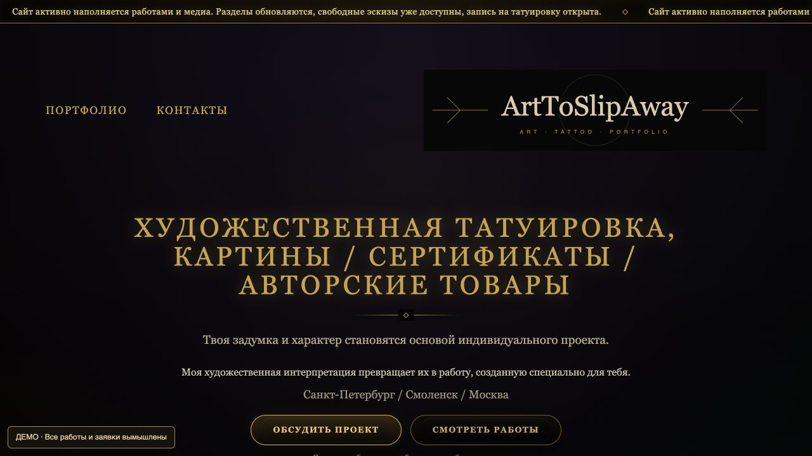
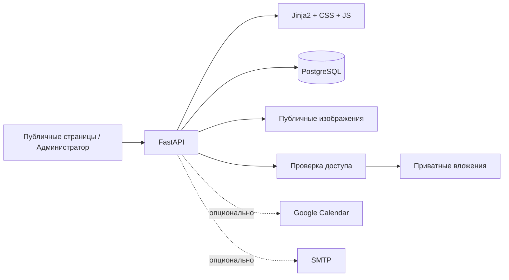
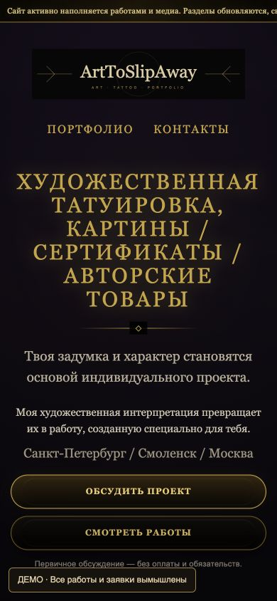
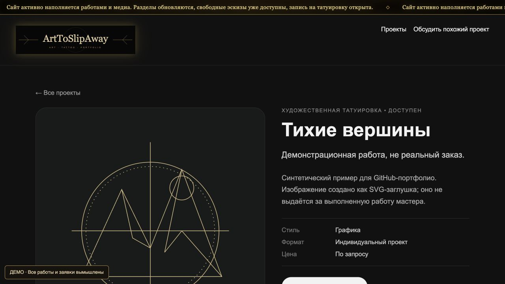
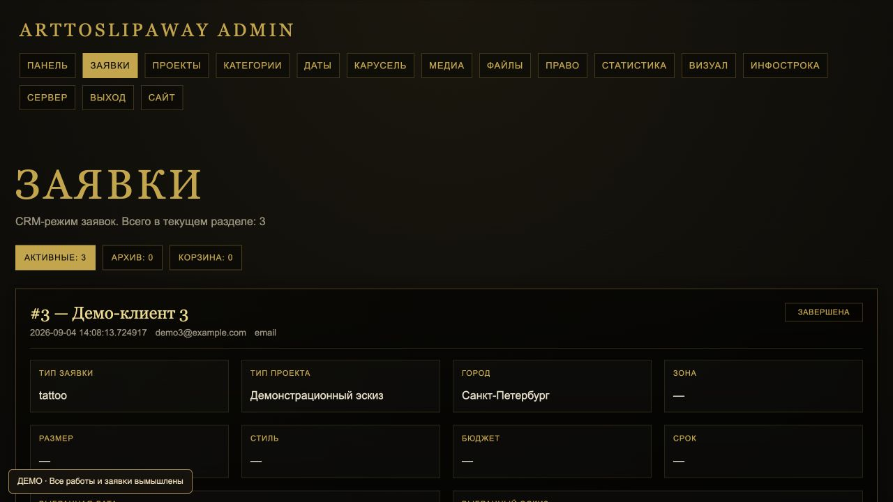

# ArtToSlipAway

[](https://github.com/ArtToSlipAway/arttoslipaway-website/actions/workflows/verify.yml)

Сайт-портфолио и CRM для художника и тату-мастера: от просмотра работ и выбора
даты до заявки, административной обработки и закрытого клиентского кабинета.

Очищенная версия действующего проекта для GitHub-портфолио. Реальные заявки,
ключи, пароли и загруженные клиентами файлы не публикуются. Демоверсия содержит
вымышленные данные и SVG-иллюстрации, **не реальные выполненные работы мастера**.



## Возможности

- каталог направлений и отдельные страницы работ;
- короткая и расширенная формы заявки, вложения, выбор города и даты;
- CRM: статусы, приоритеты, заметки, архив и корзина заявок;
- клиентские ссылки с ограниченным сроком действия;
- приватное скачивание вложений с проверкой доступа к конкретной заявке;
- медиатека, карусель, объявления, административные настройки;
- необязательные Google Calendar (read-only) и SMTP;
- локальная статистика с хешированием IP; клиентские URL с токенами не учитываются;
- проверки доступности приложения и PostgreSQL.

## Стек и архитектура

Python 3.12+, FastAPI, PostgreSQL 16, psycopg2, Jinja2, JavaScript, CSS.
Локальный запуск — Docker Compose; серверные примеры — Nginx/systemd.



```text
app/
  main.py                    сборка приложения и middleware
  db.py, config.py, views.py  общая конфигурация, БД, шаблоны
  auth.py                    административные сессии
  routes_public.py           каталог и публичные страницы
  routes_requests.py         заявки и транзакционная загрузка
  routes_private_files.py    защищённое скачивание вложений
  routes_admin_*.py          административные разделы
  routes_calendar.py         свободные даты и календари
  routes_carousel.py         карусель
  templates/partials/       динамические части шаблонов
  static/pages/             вынесенные стили и скрипты
  static/demo/              демонстрационные иллюстрации
scripts/                    настройка, наполнение и HTTP-проверки
tests/                      модульные проверки
schema.sql                  только схема, без production-данных
```

Маршруты разделены по назначению. В `main.py` нет логики каталога, заявок и
календаря. При разделении шаблонов сохранён порядок стилей и скриптов;
динамические Jinja2-блоки находятся в `templates/partials/`.

## Быстрый запуск демоверсии

Понадобятся Docker с Compose и Python 3 для создания локальной конфигурации.

```bash
git clone https://github.com/ArtToSlipAway/arttoslipaway-website.git
cd arttoslipaway-website
python3 -m scripts.setup_demo
docker compose up -d --build --wait
docker compose exec web python -m scripts.seed_demo
```

Откройте [localhost:8000](http://localhost:8000). Вход администратора:
[/admin/login](http://localhost:8000/admin/login). Логин `admin`, случайный пароль
записан только в локальном `.env` (`ADMIN_PASSWORD`). Этот файл нельзя публиковать.

`setup_demo` создаёт независимые случайные секреты и не перезаписывает существующий
`.env`. `seed_demo` наполняет пустую базу: 5 категорий, 3 работы, 3 вымышленные
заявки и тестовый слот. Повторное наполнение демобазы ничего не меняет; при
обнаружении существующих рабочих данных скрипт останавливается.

До наполнения главная и форма заявки также работают, но каталог пустой.
База и приватные вложения хранятся в отдельных Docker volumes, публичные загрузки —
в `app/uploads`. Приложение доступно только с локального компьютера.

```bash
docker compose down
```

Остановка не удаляет данные. Не добавляйте `--volumes`, если их нужно сохранить.

## Запуск без Docker

Потребуются Python 3.12+ и отдельная PostgreSQL 16.

```bash
python3 -m venv .venv
source .venv/bin/activate
pip install -r requirements.txt
python -m scripts.setup_demo
```

Создайте отдельную базу `arttoslipaway_demo`. Настройте `DB_HOST`, `DB_PORT`,
`DB_NAME`, `DB_USER`, `DB_PASSWORD` в `.env` под свою локальную PostgreSQL.
Загрузите схему (параметры `psql` должны соответствовать вашей базе):

```bash
psql -h 127.0.0.1 -U YOUR_LOCAL_ROLE -d arttoslipaway_demo -v ON_ERROR_STOP=1 -f schema.sql
python -m scripts.seed_demo
uvicorn app.main:app --host 127.0.0.1 --port 8000 --no-access-log
```

При другом порте обновите `SITE_BASE_URL` и `ADMIN_CSRF_ALLOWED_ORIGINS`.
Для schema.sql нужен актуальный клиент `psql` с поддержкой `\restrict` (проверен 16.15).

## Проверки

```bash
# Без запущенной базы
python -m unittest discover -s tests -v

# Полный сценарий в уже запущенной Docker-демоверсии
docker compose exec web python -m scripts.verify_demo
```

Модульные тесты проверяют сессии, обязательный секрет, пустой пароль, локальные
перенаправления, шаблоны, ограничения загрузок и отказ для недопустимых путей.
HTTP-проверки проходят через реальную PostgreSQL: страницы, вход, создание
заявки, откат при неверном файле, своё и чужое вложение, истечение и отзыв ссылки.

Интеграционный сценарий допускает только локальный адрес, требует `DEMO_MODE=true`
и маркер демонстрационной базы. Он удаляет только созданные им тестовые заявки
и вложения. Не запускайте его на рабочей базе.

[GitHub Actions](https://github.com/ArtToSlipAway/arttoslipaway-website/actions)
собирает Docker-образ, запускает новую PostgreSQL, проверяет пустую базу,
наполняет демоданные и выполняет оба набора тестов. Секреты рабочего сайта не нужны.

## Скриншоты

Все изображения сняты с локальной демоверсии без персональных данных клиентов,
административных паролей и действующих клиентских ссылок.

| Мобильная главная | Страница работы |
| --- | --- |
|  |  |




## Безопасность и переход со старой версии

Вложения сохраняются в `private_files/`, за пределами публичного `/uploads`.
Администратор скачивает файл через `/admin/lead-files/{id}`. Клиент — через
`/client/{token}/files/{id}` с проверкой принадлежности файла заявке, активности
ссылки и срока действия. Ответы не кешируются, файлы отдаются как вложения.

**Старые вложения из `/uploads` не становятся приватными от простого обновления
кода.** Перед внедрением на существующий сайт нужен отдельный перенос файлов
и обновление записей БД: [безопасное внедрение](docs/SECURITY_AND_DEPLOYMENT.md).

Настоящие `.env`, credentials, SSH-ключи, дампы, журналы и каталоги загрузок
исключены из Git. Это не заменяет повторный поиск секретов перед публикацией:
[чек-лист](docs/PUBLICATION_CHECKLIST.md).

## Интеграции и ограничения

- Google Calendar и SMTP по умолчанию выключены. Настройки — в `.env.example`.
  Файл сервисного аккаунта Google не входит в образ; подключайте его read-only отдельно.
- В деморежиме фоновые видео выключены; настоящих фотографий и 3D-моделей нет.
  Библиотека 3D-просмотра включена с [уведомлениями о лицензиях](THIRD_PARTY_NOTICES.md).
- `DEMO_MODE=false` отключает метку, но не удаляет вымышленные записи. Для рабочего
  сайта нужна отдельная база и собственные материалы.
- Внешняя Google Analytics в этой поставке отключена.
- Лимит вложения — 25 МБ, не более четырёх на заявку. Проверяются расширение и
  сигнатура, но это не антивирусная проверка.
- Юридические страницы содержат демонстрационные реквизиты и требуют отдельной подготовки.
- Диагностика systemd работает только на соответствующем Linux-сервере.
- SQL-доступ синхронный; нагрузочное тестирование и полный аудит безопасности не выполнялись.
  Это демонстрация проекта, а не обещание готовности к любой нагрузке.

Изменения GitHub-версии не применяются автоматически к действующему сайту.
